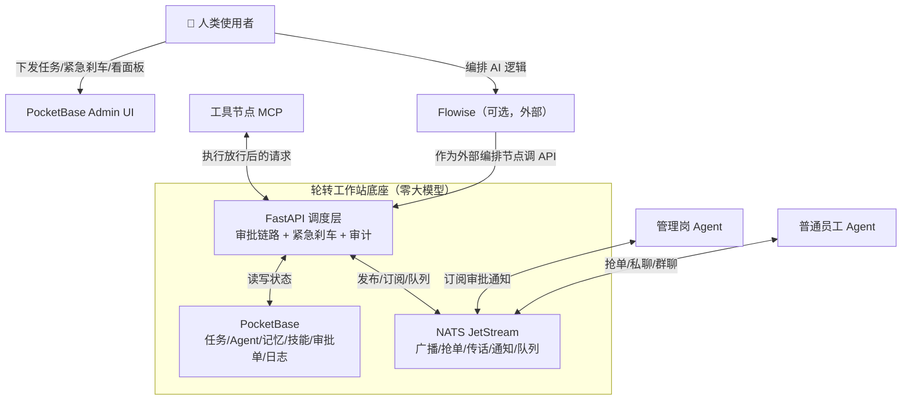

# Agent-Rotary-Station v3 三件套架构方案

> 状态：草案（待用户确认后进入实施）
> 目标：把当前 v0.2 的单体「FastAPI + SQLite + 后台线程」架构，演进为「PocketBase（状态）+ NATS JetStream（通信）+ Flowise（可选 AI 编排）」三件套。
> 底线：**底座仍零大模型**；Flowise 只是外部接入的编排节点，LLM/向量/RAG 不进底座。

---

## 1. 三个组件是什么（一句话）

| 组件 | 本质 | 在 ARS 里负责 |
|---|---|---|
| **PocketBase** | 单文件 BaaS（~15MB）：SQLite + 自动 REST API + 实时 WebSocket 订阅 + Admin UI + 认证 | 存任务/Agent/记忆/技能/审批/日志，给人类一个可视化管理面板 |
| **NATS + JetStream** | CNCF 开源消息系统（~15MB）：Pub/Sub、Queue Groups 抢单、Request-Reply、持久化回放、延迟消息 | Agent 间传话、任务广播、抢单队列、审批通知、心跳、工具队列补发 |
| **Flowise（可选）** | 开源低代码 AI 工作流编排（基于 LangChain）：拖拽画布、RAG、Chatflow/Agentflow、导出导入 JSON、一键 API | 任务拆解、内容生成、RAG 问答等需要大模型的「脑力活」，作为外部编排节点调用 ARS API |

---

## 2. 总架构图



---

## 3. 功能映射：现有 12 张表 → PocketBase collections

### 3.1 PocketBase collections（承接全部「状态 + 记录」）

| 现有 SQLite 表 | PocketBase collection | 关键字段 | 说明 |
|---|---|---|---|
| `agents` | `agents` | `agent_id`(unique), `name`, `role`, `status`, `capabilities`, `last_heartbeat` | 花名册；manager 标签即 `role='manager'` |
| `tasks` | `tasks` | `task_id`(unique), `title`, `description`, `status`(pending/in_progress/done), `manager_id` | 任务记录与状态，实时订阅状态变化 |
| `task_members` | `task_members` | `task_id`, `agent_id`, `role`, `joined_at` | 任务组关系 |
| `messages` | `messages` | `msg_id`(unique), `channel_type`, `from_agent`, `to_agent`, `task_id`, `content` | 聊天流水（只留痕不转记忆） |
| `memories` | `memories` | `domain`, `mem_key`, `content`, `owner_agent` | 三层记忆池 |
| `memory_approvals` | `approvals` | `request_id`, `kind`(memory/tool/workflow), `agent_id`, `action`, `status` | 审批单统一化，`kind` 区分类型 |
| `skills` | `skills` | `skill_id`(unique), `name`, `description`, `param_schema`, `endpoint_url`, `status` | 技能市场 |
| `tool_requests` | `tool_requests` | `request_id`(unique), `agent_id`, `skill_id`, `params`, `status` | 工具调用请求 |
| `tool_queue` | `tool_queue` | `request_id`(unique), `retries`, `expire_at`, `status` | 离线排队（未来可由 JetStream 消费者取代） |
| `workflows` | `workflows` | `workflow_id`(unique), `name`, `definition`(json), `status` | 工作流定义 |
| `workflow_runs` | `workflow_runs` | `run_id`(unique), `workflow_id`, `status`, `current_node`, `result` | 工作流运行实例 |
| `audit_logs` | `audit_logs` | `ts`, `actor`, `action`, `target`, `detail` | 全链路审计 |

### 3.2 PocketBase 带来的三个直接收益

1. **WebSocket 实时订阅**：Agent/前端订阅 `tasks` 变化，任务状态一改立即推送，不再轮询。
2. **Admin UI**：人类零代码管理 Agent、任务、技能、记忆、审批单——顶掉大部分自研 WebUI 的 CRUD 页。
3. **自动 REST API**：建 collection 即得 CRUD，减少自研路由的样板代码。

> ⚠️ 注意：PocketBase 自动 CRUD 是「直连数据」的，**不能**用来绕过审批。写记忆、调工具、跑工作流仍必须走 FastAPI 调度层，由管理器审批。Admin UI 只用来「看」和「改元数据（如调岗、禁用技能）」，不替代业务写路径。

---

## 4. NATS JetStream：subject + stream 设计

### 4.1 Subject 命名约定

```
station.agents.<agent_id>.inbox      # 发给某个 Agent 的私聊
station.tasks.<task_id>.broadcast    # 任务广播（所有组员订阅）
station.tasks.<task_id>.grab         # 抢单队列（Queue Group，一条只被一个抢）
station.tasks.<task_id>.chat         # 任务群聊
station.approval.inbox               # 审批请求（manager 订阅）
station.approval.result.<agent_id>   # 审批结果回投发起者
station.tools.queue                  # 工具离线排队/重试
station.skills.announce              # 技能注册/禁用公告
station.emergency.block              # 紧急刹车广播
station.agents.heartbeat             # Agent 心跳
```

### 4.2 Stream 设计（JetStream 持久化）

| Stream | 订阅 subject | 用途 | 关键配置 |
|---|---|---|---|
| `APPROVALS` | `station.approval.*` | 审批请求持久化，manager 掉线不丢 | 保留 24h，ack 后删除 |
| `TASK_EVENTS` | `station.tasks.*` | 任务广播/抢单/状态变更事件 | 保留 7d，可回放 |
| `TOOL_QUEUE` | `station.tools.queue` | 工具失败重试队列 | 手动 ack，退避重投 |
| `HEARTBEATS` | `station.agents.heartbeat` | 心跳与超时判定 | 短保留，配合延迟消息 |

### 4.3 关键场景对照

| 现有能力 | 迁移后实现 |
|---|---|
| `/tasks/broadcast` 轮询 | manager 发 `tasks.<id>.broadcast`，在线员工实时收到 |
| `/tasks/assign` 手动指派 | 发到 `tasks.<id>.grab` 队列，第一个消费的 Agent 抢到 |
| `/messages/send` HTTP 传话 | NATS 实时送达 + PocketBase 落流水 |
| `/memories/approvals/*` 审批 | 审批请求进 `APPROVALS` stream，manager 掉线消息不丢，新 manager 上任接着消费 |
| `tool_queue` + 后台线程补发 | JetStream 消费者 + `Nats-Schedule` 延迟重投 + 过期丢弃 |
| `/heartbeat` 后台线程扫超时 | Agent 发心跳 + JetStream 延迟消息触发置 offline |
| `/emergency-block/toggle` | 发 `station.emergency.block`，所有 Agent 秒级停手 |

---

## 5. Flowise 接入协议（可选，守住红线）

### 5.1 定位

Flowise 是**外部编排节点**，角色等同于一个「会思考的普通 Agent」，只是它的「脑」是 LLM。

### 5.2 接入方式

```
Flowise 画布拆解任务
        │  HTTP 调 ARS API
        ▼
POST /tasks/create          # 下发拆解后的子任务
POST /messages/send          # 给 Agent 发指令
POST /memories/write         # 写记忆（走 manager 审批）
POST /skills/call / tools/call # 调工具（走 manager 审批）
POST /workflows/run          # 触发 ARS 的 DAG 调度
```

### 5.3 与现有 workflows.py 的分工

| | ARS `workflows.py`（保留） | Flowise |
|---|---|---|
| 管什么 | **跨 Agent 调度**：谁在什么顺序执行、审批挂起与恢复 | **AI 内部逻辑**：LLM 调用链、RAG、提示词、多模型 |
| 有没有 LLM | 无 | 有 |
| 交互方式 | 底座内部执行 | 外部 API 调用 |

两者可串联：Flowise 拆解出步骤 → 通过 `/workflows/run` 交给 ARS 的 DAG 去调度执行。

---

## 6. 必须守住的红线（迁移后不变）

1. **底座零大模型**：FastAPI 调度层不 import 任何 LLM / 向量库。
2. **审批链路不被绕过**：写记忆、调工具、跑敏感工作流节点，仍走 manager 审批，不允许图方便直接连 PocketBase 写数据。
3. **紧急刹车全局生效**：NATS 派发、PocketBase 写入、工具调用统一被同一个开关拦住。
4. **全链路审计**：所有关键动作落 `audit_logs`。
5. **聊天不自动转记忆**：NATS 传话只保证送达，不自动总结。

---

## 7. 迁移路线（建议分批，不一次性重构）

### P0：先迁通信层（NATS）
- 任务广播抢单、私聊群聊、审批通知、心跳、紧急刹车广播 → NATS
- 存储仍用现有 SQLite，减少风险

### P1：再迁存储层（PocketBase）
- 12 张表 → 12 个 collections，FastAPI 读写改走 PocketBase SDK
- 用 Admin UI 顶替部分 WebUI CRUD 页

### P2：可选接 Flowise
- 写 Flowise 对接示例，作为外部编排节点接入

> 每个阶段完成后跑通现有 tests 并补充新测试，确认红线未破再进下一阶段。

---

## 8. 待确认问题

1. P0/P1/P2 是否按上述顺序执行？
2. PocketBase 与 NATS 是否都部署在本机（Windows），还是后续要跨设备？
3. 是否接受「PocketBase Admin UI 顶掉部分自研 WebUI 页面」，还是保留现有 WebUI、PocketBase 仅做数据层？
